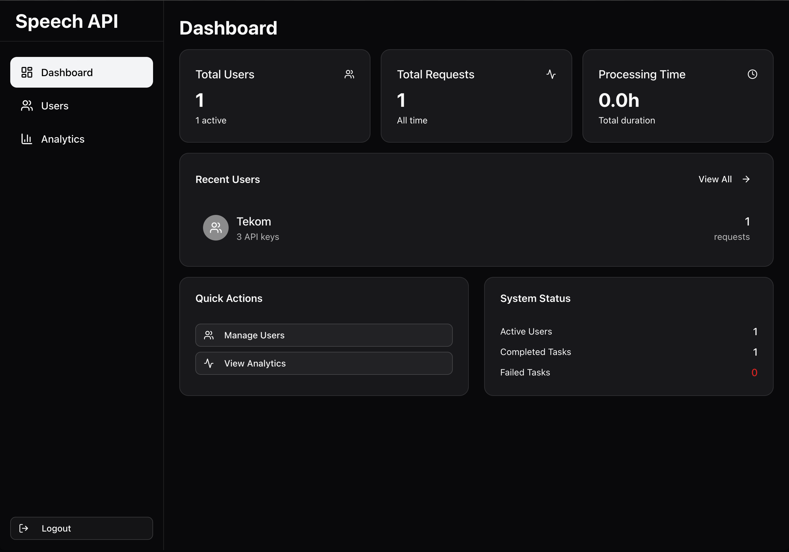

# Speech API Admin

**Speech API Admin** is a web application that allows admins to manage and monitor speech API usage. It provides a user-friendly interface for viewing statistics, managing users, and configuring settings. Related project: [Speech API](https://github.com/laviprog/speech-api)


## Features
- 📊 **Usage Statistics** — View detailed statistics on API usage.
- 👥 **User Management** — Add, remove, and manage users.
- ⚙️ **Configuration Settings** — Adjust settings for the speech API.
- 🚀 **Docker Support** — Easy to run using Docker Compose.



## Getting Started

### Installation

1. **Clone the repository:**

   ```bash
   git clone https://github.com/laviprog/speech-admin.git
   cd speech-admin
   ```

2. **Set up environment variables:**

   Create .env.local or .env.production file based on the provided .env.example:

   ```bash
   cp .env.example .env.production
   ```
   Then fill all in the required variables.

3. **Install dependencies**:

   Choose your preferred package manager:

   ```bash
   npm install
   # or
   pnpm install
   ```

4. **Run the app locally**:

    Build the application:
   ```bash
   npm run build
   # or
   pnpm build
   ```
   Run the built application:
    ```bash
    npm start
    # or
    pnpm start
    ```

Open http://localhost:3000 to view it in the browser.

## Running with Docker

To launch the app in a Docker container:

```bash
docker compose up --build -d
```

Make sure to update the environment variables in the .env.production file or configure them through Docker.
